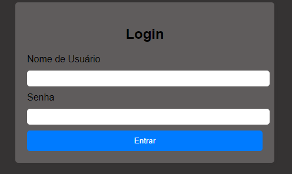

# Formulário de Login
## Índice 
* [Descrição](#descrição)
* [Introdução](#introdução)
* [Funcionalidades](#funcionalidades)
* [Técnicas e tecnologias utilizadas](#técnicas-e-tecnologias-utilizadas)
* [Fontes Consultadas](#fontes-consultadas)

## Descrição

## Introdução
## Funcionalidades 
## Tecnologias e técnicas utilizadas
* [<code></code>](https://developer.mozilla.org/pt-BR/docs/Web/HTML)
* [<code></code>](https://developer.mozilla.org/pt-BR/docs/Web/CSS)
* [<code></code>](https://git-scm.com/)
* [<code></code>](https://code.visualstudio.com/)
* [<code></code>](https://github.com/)
## Fontes consultadas

## Autor
